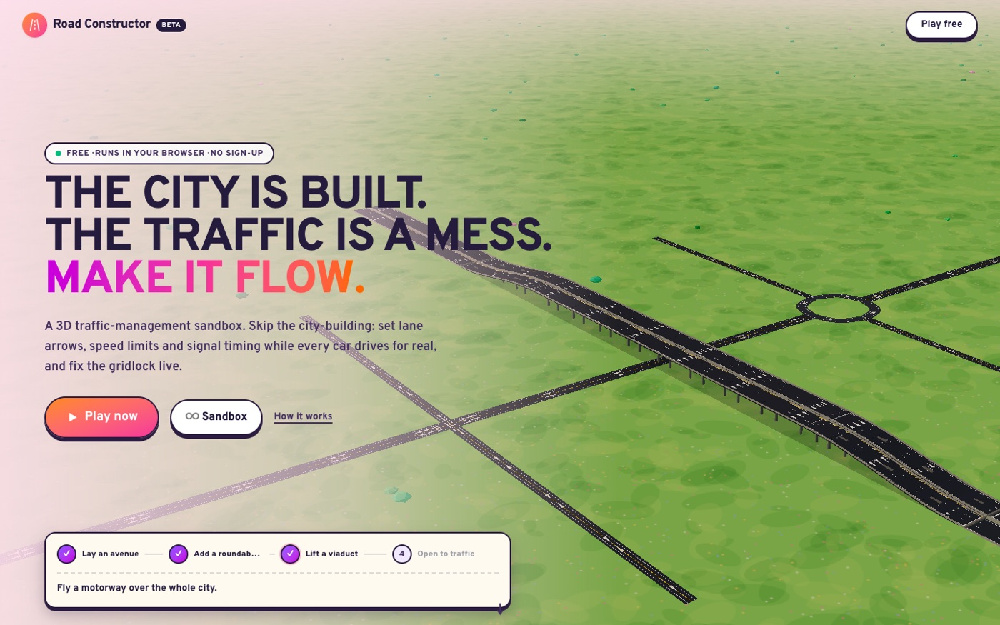
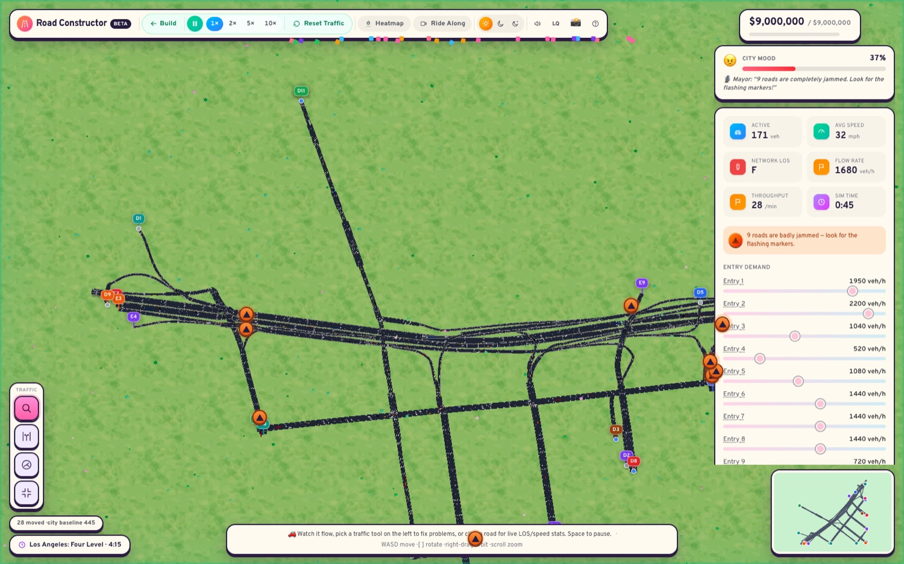
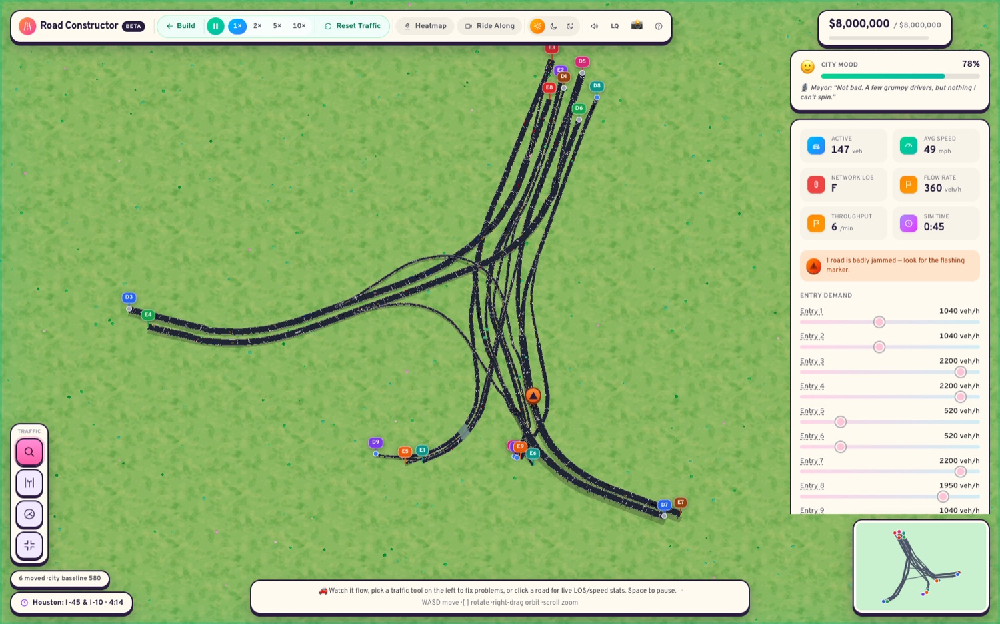
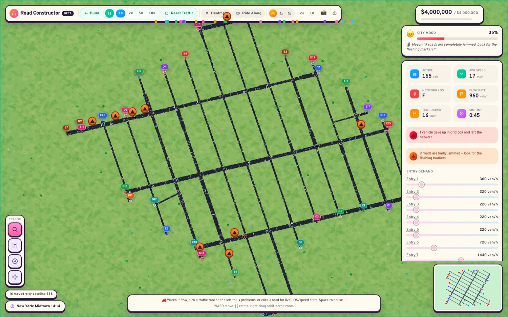

# Road Constructor

**The city is built. The traffic is a mess. Make it flow.**

A free, in-browser 3D traffic-management game. You don't build the city — you fix its traffic: lane arrows,
speed limits and signal timing, while every car drives for real. Play it on desktop or phone, no sign-up.



## What's in it

- **A real traffic simulation.** Every vehicle follows the Intelligent Driver Model (IDM) for car-following and
  MOBIL for lane changes, running in a Web Worker at 30 Hz so the UI never stalls.
- **Traffic Manager tools** (in the spirit of TM:PE): per-lane turn arrows, speed limits, signal groups, priority
  junctions, signal *offsets* so you can build a green wave, bus and bike lanes, one-way streets and pedestrian
  crossings, bus stops and street parking. Roads cost upkeep while traffic runs; parking brings some back.
- **A living city.** Buses and bicycles share the road, ambulances race through it, people cross at crossings (or step
  out where there isn't one), and a 24-hour cycle with rain and fog changes how everyone drives.
- **Real cities.** Seventeen levels built from actual OpenStreetMap data — the Los Angeles Four Level, Times Square,
  the Gardiner Expressway in Toronto, Houston's I-45/I-10 knot, San Antonio's "Y", downtown Monterrey, the Dallas
  High Five, Chicago's Jane Byrne Interchange, Atlanta's Spaghetti Junction, and the whole Lincoln Tunnel run: from the
  Weehawken helix, under the Hudson, across Midtown and out to Queens and Brooklyn (a thirty-minute, six-mile level with
  the real Hudson and East River). Lane counts, speed limits, bridges, tunnels, roundabouts and traffic lights are the
  real ones. Monterrey has eight spots in all: downtown, the Tec, Valle Oriente, Ciudad Universitaria, Gonzalitos by
  the Hospital Universitario, Fundidora, the Estadio BBVA and Juan Pablo II.
- **TxDOT overpasses.** On the Texas maps (Houston, San Antonio, Dallas) elevated roads are light concrete with open-slot
  Texas Classic rails and concrete bents, and the road sounds like it: the ba-dum of slab joints and a higher tyre whine.
  Everywhere else keeps asphalt decks.
- **Clover Crossing.** A cloverleaf interchange designed for the game, not taken from a map: a freeway climbs over
  another, four loops carry the left turns and four outer ramps the right turns, and the weaves between them are the
  puzzle.
- **Continuous-flow lefts.** With left turns giving way to oncoming traffic, a few waiting cars hold up a whole
  approach. The Junctions tool can displace a left turn ahead of a signalised junction: the turners cross over at a
  small signal and run with the through traffic, and nobody waits for a gap. The *Continuous Flow* level is built
  around it.
- **Gantries.** Freeway stretches carry overhead gantries (Gantries tool, `G`): post a speed advisory to smooth a
  shockwave, or close a lane with a red X, and drivers merge out a quarter mile ahead.
- **Incidents.** Stalled semis, debris and fender benders block lanes (Events menu, Chaos mode, scripted in levels like
  Clover Crossing). Tap the pin to send a wrecker, which drives the shoulder to the scene; police come to crashes on
  their own.
- **Soundscape.** Tyre roar near the camera (louder and brighter on wet asphalt), semis engine-braking on downgrades, and
  the expansion-joint clack on viaducts, all attenuated with distance from the camera or chase view.
- **Drone flyover.** After winning a level, a dusk-to-night flyover with time-lapsed traffic and light trails. Save a
  clip or copy a link to challenge a friend.
- **Campaign, daily challenge and sandbox.** Hand-built levels with par-based stars, scripted trouble (a stalled
  car, a stadium letting out), a seeded daily scenario, and a no-money-limit sandbox.
- **Real merges and exits.** Where a ramp joins or leaves a bigger road, its pavement rides alongside as an added
  lane, tapers to a tip at the highway's edge and gets a hatched gore wedge; cars take the same path and enter the
  right lane. Where a road's lane count changes, its pavement eases between the two widths instead of stepping.
- **A full road builder.** Draw roads at seven elevations from tunnel to a tier-3 flyover, with grade limits and
  clearance checks.
- **Photo mode, share links, night/dusk lighting, ride-along camera, heatmap.** Save a shareable result card from any
  finished level, or record an 8-second clip of your city from photo mode.
- **Shaped vehicles and real scenery.** Cars, semis, buses, ambulances, police cars and cyclists each have their own
  model; real cities are surrounded by their actual buildings from OpenStreetMap.
- **Crashes, transit and challenges.** Crashes block a lane until police actually drive there. Draw your own bus lines.
  Turn any city into a "beat my score" link a friend can open, with no server.
- **Settings menu.** Graphics presets plus advanced toggles (shadows, bloom, vehicles, scenery, resolution, frame cap,
  car limit), sound, and accessibility options (reduce motion, larger text, bold markers). Keyboard play: N steps through
  roads for the lane, speed, street and bus-line tools; messages are announced to screen readers.
- **A cinematic tour.** One click hides the UI and flies around the city.
- **A guided first level.** *First Shift* walks a new player through the three core tools and ticks each step off by
  what they actually changed.
- **Runs cool on weak machines.** Three quality tiers, an adaptive frame limiter that idles when nothing moves,
  and an auto-downgrade if the frame rate drops.
- **Works on phones.** One finger pans, two fingers pinch and rotate, tap to build.

| | |
|---|---|
|  |  |
|  | |

## Run it

```bash
npm install
npm run dev      # http://localhost:3000
npm run build && npm start
```

Next.js 16 / React 19 / React Three Fiber / Zustand / Tailwind 4. No backend; progress is stored in
`localStorage`, and layouts can be shared as a link (`#data=…`, compressed and schema-validated with zod).

## Daily leaderboard (optional)

The daily challenge can post scores to a public board. It needs a Redis database; the free Upstash tier is plenty.
Set `UPSTASH_REDIS_REST_URL` and `UPSTASH_REDIS_REST_TOKEN` (see `.env.example`), or add Upstash from the Vercel
Marketplace, which sets the equivalent `KV_REST_API_*` variables. Without them the game works exactly the same and
just hides the board. Scores are reported by the browser, so it is an honour-system board: the API checks that a
score is plausible and rate-limits posting, but cannot prove a run was played.

## How it works

```
src/
  sim/        pure TypeScript simulation — no React, no DOM
    worker.ts     the 30 Hz loop: spawning, IDM, MOBIL, signals, events, stats
    network.ts    turns an edge/node graph into splines, lanes and lane-to-lane moves
    idm.ts        car following
    scenarios.ts  campaign levels, challenge scoring, the daily scenario
    real/         city networks baked from OpenStreetMap (see below)
  state/      Zustand editor store (network, budget, undo/redo) and persistence
  components/ the R3F scene (roads, vehicles, terrain) and the HUD
  hooks/      worker bridge and scenario runner
scripts/osm/  OpenStreetMap -> game network converter
```

**The worker protocol is small.** The main thread sends network and edit patches
(`updateNetwork`, `patchEdges`, `patchNodes`, `scheduleEvents`, …); the worker streams back vehicle snapshots and
a stats object every 200 ms. Snapshots stop entirely while paused.

**Performance choices worth knowing about:** the canvas runs with `frameloop="never"` and a custom limiter, so a
paused or idle game costs almost nothing; road geometry is memoized per edge; vehicles are instanced; and the
headless harness described below made it possible to measure all of this rather than guess.

## Real cities from OpenStreetMap

`scripts/osm/build.ts` downloads a bounding box from Overpass, clips and splits the ways at junctions, maps OSM
road classes to game classes, derives bridge/tunnel heights from `layer`/`bridge`/`tunnel` tags, places signals
from `highway=traffic_signals`, finds entries and exits at the box boundary, drops disconnected fragments, and
writes `src/sim/real/<city>.json`. The results are committed, so nothing is fetched at runtime.

```bash
npx tsx scripts/osm/build.ts            # all cities
npx tsx scripts/osm/build.ts houston    # one city
```

Add a city by adding a bounding box to `scripts/osm/cities.ts`, running the script, and adding a plan to
`REAL_PLANS` in `src/sim/scenarios.ts`.

Star targets are relative to each city's own baseline — what the unchanged network moves in five minutes — so
a level can't be won by doing nothing and can't be failed by an unlucky seed.

## Testing the simulation headlessly

Because `src/sim` has no DOM dependencies, the real worker can run in Node. That is how baselines are calibrated
and how regressions are caught: see `scripts/sim/` and run

```bash
npm run test:sim
```

## Credits

Road data © [OpenStreetMap](https://www.openstreetmap.org/copyright) contributors, available under the
[ODbL](https://opendatacommons.org/licenses/odbl/). Typeface: Overpass (SIL OFL).
